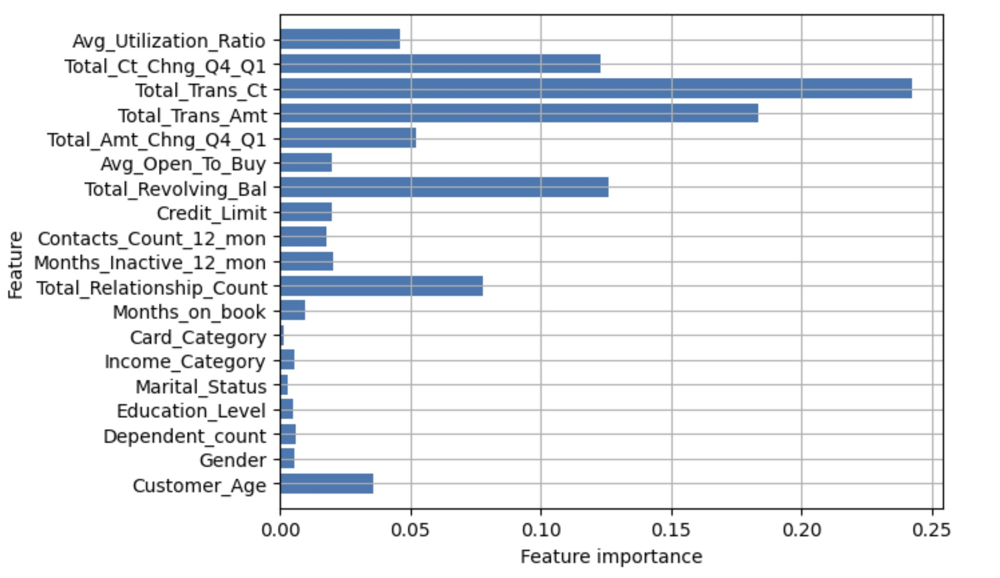

## Credit Card Customer Churn Prediction
  
The project is a replicate of a kaggle project, aiming to predict whether a customer churns based on features, such as their buying behaviors and demographics.
[Project Link](https://www.kaggle.com/datasets/thedevastator/predicting-credit-card-customer-attrition-with-m)

## Description
  
- This final project deploys five major machine learning models, including:
    - Linear Regression Model
    - Logistic Regression Model with regularization
    - Naïve Bayes Model
    - Nonlinear Support Vector Machine
    - Random Forest  

to predict whether a customer is likely to stay with the bank for its credit card product, and  identify some of the crucial features that best capture customers’ decisions to provide insights for the company when making business decisions.
- Also, this project points out that the most voted notebook on Kaggle actually suffers from several serious technical flaw, making the results not convinving. Details can be seen at the Appendix section of Jupyter notebook or Final Report.

## Method and Performance Evaluation
  
- For each of the five methods, we conduct stratified k-fold cross validation (because of imbalanced dataset), grid search on 
hyperparameter if available, and evaluate model performance based on confusion 
matrix and classification report. In particular, we focus more the predicting performance 
of class 0 (customers leaving), since companies tend to hurt directly when revenues 
decrease. **Weighted Average Accuracy**, **Recall rate**, and **F1-score** are three main indicators we concern most.

- Below are the top three model we have

| Performance (Class 0) | Accuracy  | Recall | F1_score | Run Time (sec) |
| --------------------- | --------- | ------ | -------- | -------------- |
| Random Forest         | 0.96      | 0.83   | 0.86     | 12.58          |
| Nonlinear SVM         | 0.93      | 0.73   | 0.78     | 419.99         |
| Naïve Bayes           | 0.89      | 0.68   | 0.66     | 3.75           |

## Most Important Features
- By utilizing Random Forest Model, we can observe certain features can help 
us better predict decisions made by customers. From the graph below, we can conclude 
it is more likely for company to identify attrition of customers based on transaction 
amount, count and total revolving balance of customer.

## Note
  
- The Final_Report pdf file was written in Mid 2023, whereas the Jupyter Notebook was rerunned recently before pushing to this repo. Although some numbers on model performance might differ, the conclusions remain unchanged.